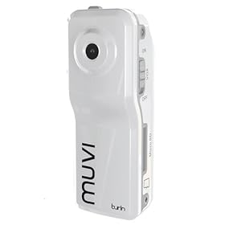

I want to find the perfect camera for your classroom, I don't expect to find a one size suits all type solution.  
  
[Challenge CLC](http://www.challengeclc.co.uk/) have been extremely kind in funding this project and Bradford schools have been more then happy to write a review based on their experiences with the different cameras. My plan is to rotate the cameras between schools and classrooms to get multiple reviews on each camera.  
  
We are buying 10 cameras and reviewing them over the next few weeks. Also thanks to @Raff31, @LordLangley73 and @DeerWood for their input. We will be using [this document](http://docs.google.com/present/view?id=dhn2vcv5_6tv55j7g9) for suggestions on ways to use these cameras.

Our shortlist (of which we probably need to remove 1/2):

1. Kodak Zi6 (£90)
2. \*Kodak Zi8 (£120)
3. Toshiba Camelio P30 (£115)
4. Panasonic SDR S15 (£160)
5. +/ Apple iPod Nano 8GB 5Th generation (£105)
6. / Zoom Q3 (£200)
7. Veho VCC 002 (£100)
8. Panasonic SDR S26 (£163)
9. Kodak Zx1 (£70)
10. \*Sanyo VPC CG10EBK / Xacti (£145)
11. / Mustek DV316L (£38)
12. / Samsung U10 (£83)
13. Veho VCC-001 (£90) (Not sure on this one because its designed for youtube)
14. m/ Sony MHS-PM1 (£130)
15. / Creative Vado (£54)
16. / Creative Vado HD (£90)
17. Vivitar DVR 545 (£70)
18. +/ \*Flip Video Ultra High Definition Camcorder 8GB (£120)
19. +/ Flip Video Ultra Camcorder 2nd Generation 4GB (£90)

And a bit controversial:

1. Actioncam Action Video Camera (£28)
2. +Veho VCC-003 Muvi (£50)

\* = Comes highly recommended  
/ = Stunning design  
\+ = Built in memory (Enough to record video)  
m = Special memory required

Which would you remove? Has anyone seen any info on an action video camera being used in a classroom before? Does this seem completely silly? I like Silly, do you?

**Removing the first bunch..**

Getting my list down was painfully difficult, I wanted to try as many cameras as possible but some where too expensive or not suitable and my budget is limited!

Here is are the camcorders I removed and reasons for removing them:

1. Panasonic SDR S15 (£160) -- too expensive
2. Panasonic SDR S26 (£163) -- too expensive
3. Zoom Q3 (£200) too expensive
4. Vivitar DVR 545 (£70) -- out of stock

Total amount to spend is now only £1440 for cameras and £195 for memory cards! Bargain for 17 cameras! Now to see if we can get that level of funding! :)
