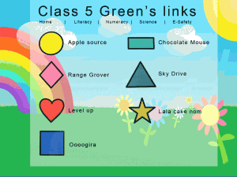
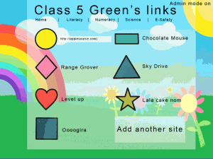

Worst post title ever.  I just did a mock up for [Ian Addison](http://ianaddison.net) and I figured I would share it.

Only took 1 minute, it is just an idea and may never be made, I quite like it, what do you think?

Something similar will already exist, I just don't know about it?

Either way I could make something like this in 1 to 2 hours from start to finish so if you like it let me know and I will make/host it.

The reason I used shapes/colours instead of thumbnails was so a teacher can say "Click on the red love heart" or the "yellow circle" instead of click on the thing that looks like a granny racing a unicorn.

Double.

I added an admin screen design so Ian could see how to edit a URL.  It detects the title from the URL and I added a new site button to this view.

