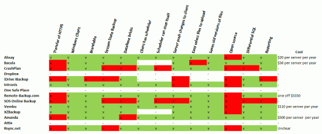
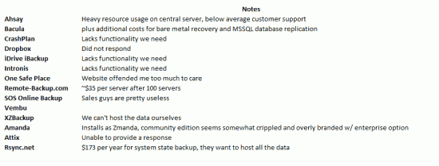

Every 2 years [Primary Technology](http://primaryt.co.uk) re-engineers all of it's services and this year I have been tasked with re-engineering our [School offsite / remote backup service](http://schoolbackups.co.uk). Our current service works well but there are a few things we would change and we feel our current provider isn't really giving us the support we need to make these changes.

The first part of any successful re-engineering job is to gather a comparison of all the available products on the market.

I reviewed these products/pieces of software:

- Ahsay
- Attix
- Bacula
- Crashplan
- Dropbox
- iDrive Backup
- Intronis
- One Safe Place
- Remote-Backup.com
- Rysnc.net
- SOS Online Backup
- Vembu
- XZBackup
- Amanda/Zmanda

And I reviewed them based on this following requirements of functionality:

- Can the client transfer data and config over [HTTPS](http://en.wikipedia.org/wiki/HTTP_Secure "HTTP Secure")?
- Does a Windows client Exist?
- Is the software brandable?
- Can I perform a system state backup on the clients?
- Can it export database bricks / incremental / differential backups
- Does the client have a scheduler?
- Can the client stop itself at a specified time
- Can the server push changes to the client backup set?
- Can the client easily select which files to upload?
- Does the server save old versions of files?
- Is the software open source?
- Does the server have overview reporting?

And my notes which probably contain the most important informative information:

