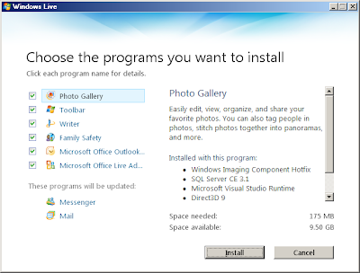
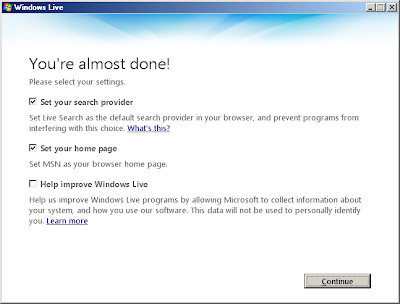

Today im reviewing Microsoft Family Safety with a consideration on e-Safety for parents

> "With Family Safety, you decide how your kids experience the Internet. You can limit searches, block or allow websites, decide who your kids can communicate with when they’re using Windows Live Messenger, Hotmail, or Spaces and monitor what websites they're visiting..."

In this review I will be installing the package and looking at what this really means in real life.  
  
The product is easily downloadable from [http://download.live.com/familysafety](http://download.live.com/familysafety)  
  
Once you have downloaded and run the package you get this installer screen:

  
  

I was shocked to see Photo Gallery, Toolbar, Writer, some outlook and some Live Add ins bundled. Also SQL Server CE 3.1 is required and some of my applications will be updated.

  

For me this is bloatware already. I want an application that does what it sais in the blurb so I am going to remove all of the additional programs except from Family Safety (However you may want some of this functionality).

  

With everything else removed the install is a quite large 109 MB. I hope this disk space usage is justified.

  

I needed to close MSN messenger to proceed and the install process took 8 minutes to complete on a machine with with an Intel Core2 6600 & 2 GB ram.

  

Once install is complete you are presented with this screen:

  

  

I have already set my search provider to [google](http://google.com/) safe search and my home page to [Primary School Safe Search](http://primaryschoolict.com/) so I don't want to do that. I also don't want to help improve Windows Live, not right now.

  

Now for a restart... Microsoft never seemed to learn that this is the most frustrating thing about most of their products for IT professionals however parents might not mind this restart as much.

  

After the restart I was prompted to "Sign Up" to Windows live but I already have windows live so I clicked Close. Nothing has been placed on my desktop or start menu and Windows Live Messenger has not opened as it usualy does. Very bad first impression.

  

I had to browse to Start - Windows Live - Family Safety, here I tried to sign in as a parent using my hotmail/live username/password. I was given an Error That I have not yet ereviews the Windows Live Terms of Use. No link was provided. I logged into my hotmail to look for the Live Terms of Use.. I clicked More then Family Safety and then clicked "I accept".

  

Then I clicked Sign in again, now im in. Already im convinced this is too complicated for parents.

I am going to leave it here for today, it has been 30 minutes so far and the install is done but the configuration isn't.

  

In my opinion most parents would simply not go through this entire process as it is too complicated.

  

Part 2 of this post will review configuration. Expect it in a few days.
