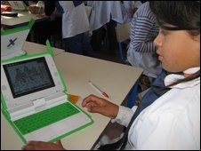
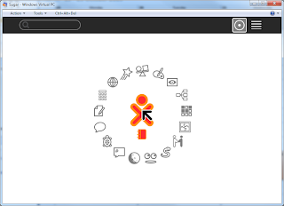
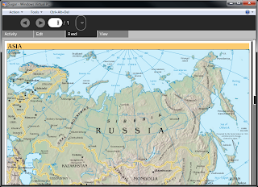

What is Sugar?

  

SOAS (Sugar on a stick) is the free easily accessible Operating System by Sugar Labs which is being used for the One Laptop Per Child initiative. SOAS is free under LGPL & GPL license. SOAS is downloadable from [http://www.sugarlabs.org](http://www.sugarlabs.org/)/

  

**What have Sugar labs tried to do when creating sugar OS?**

  

Simply put, create an operating system for learning. This may or may not be the correct way to introduce a child to computing. I cannot be the descision maker of that due to my lack of experience but I can give you an insight into the performance from a usability point of view.

  

**

The (Home page) for a pupil

  

**

How smooth is the OS?

  

Very smooth, everything is pretty obvious, within a few seconds you are up and running, browsing and/or learning. Websites such as Primary Games Arena (Flash) and School Email (Microsoft Exchange OWA) work great. The browser home page is a bit boring and maybe Primary School Safe Search should be used as an alternative.

  

Changing from one application to another is seamless, although you can't keep many applications open. I couldn't find the option to shut down, I guess it was hidden..

  

**Come on John, you can't convince us that an OS on 256 MB or ram runs "smooth"!**

  

I didn't think it would myself but it does, mostly due to the fact its a clean boot up every time and there is no ability to store lots of stuff in swap space to slow things down!

  

**It can't be all gravy and chips!**

  

I found the scroll bars a little too small for young kids and I worry about the black and whiteness of the GUI. It's clean but is that what kids want? From experience, no..

  

An activity.

  

**Structured Learning..**

  

One thing the Sugar OS tries to do and I'm not convinced that is succeeds is give the pupil some sort of structured learning, by providing reading materials then activity's based on the material. I guess they think that teachers will create activity's but something tells me this may be a pipe dream.. I may be wrong though.. These activity's are also confusing me because some of them just don't open anything, I get a grey screen. I guess this part of the OS is work in progress..

  

Applications such as Joke Machine just seem to lack any true obvious structure or examples (probably due to restrictive disk space) but seem to have a great deal of potential for more experienced Sugar users.

  

**Overall review**

  

A very good operating system for learning at school and away from school. Fulfils all the requirements for a great mobile OS and seems quite engaging. My only criticism is the lack of spark on the GUI, the GUI is just too flat for me and needs some funking up!

  

**Would I use it over Windows 7 in a school?**

  

Well, a Windows 7 powered Asus EEE device is going to set the school back £300+ where as a Sugar device should cost £160 (all maintenance taken into account on both OS'). If money weren't an object I would stick with Windows 7 but if it means we can give 2 pupils a device instead of 1 then the One Laptop Per Child initiative wins hands down. Sugar's educational focus puts it ahead of other open source OS projects and even hosted cloud OS' as it provides always available learning.

  

Just don't tell my Microsoft buddy's about this post ;)
