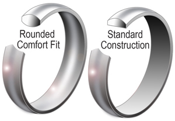
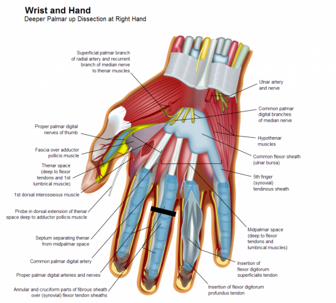
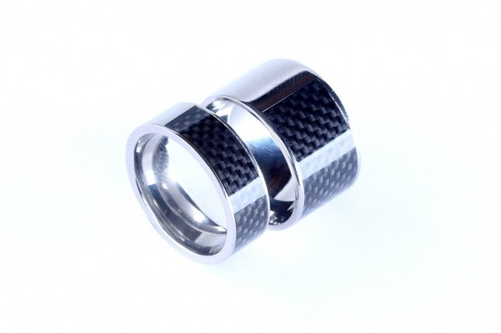

<iframe width="580" height="380" src="//www.youtube.com/embed/2YTY2q4v4VY" frameborder="0" allowfullscreen></iframe>

## Understanding the mess

To someone that works with technology the jewelry industry is a strange beast. Each standard for measurement includes a margin of error by default. This margin of error exists due to an attempt at simplification however this simplification has removed accuracy, an engineer's worst nightmare.

Many rings are hand polished, done on different machines that are setup slightly different. If a truly large number of rings are manufactured there could easily be an inconsistency as calibrated blanks (molds) could be used to set up each machine for each size of ring. ring size gauges also are not consistent, plastic ones deform when you push a ring on harder, and some are grooved in steps that also change accuracy from ring mandrel to ring mandrel.

## Wearing Rings for newbies

If this is your first ring wearing your ring will be uncomfortable at first, be prepared for a few weeks of discomfort until eventually your finger gets used to having a new friend to build a relationship with. This relationship is a two way street, your ring gives you great power but it comes at a cost. There will be times when your ring causes you some discomfort, this is normal and expected. Your finger will begin molding itself to the ring, do not be shocked or concerned if you feel some initial discomfort, if it lasts more than a few weeks then you need a different size ring.

Your fingers may sweat and some people have a reaction to skin getting to moist, trapped dirt or other materials under ring. The wider the ring the more that this is an issue. Callous’ (thick skin from activities such as drumming) can cause also issues, be mindful of this.

It's important to get a good measurement, if your ring size is wrong your ring will be uncomfortable, a few 10th of a mm can make the difference between a ridiculously comfy experience or a finger throttling nightmare. Getting a slightly larger ring is sensible, usually by +0.4mm increase of the ID (Inner Diameter).

The size of your finger changes, be careful swimming in cold places as this is the most common place to lose rings. Cold water can decrease the size of your knuckle/finger by ~0.4mm ID (Inner Diameter) in a few seconds.

## Initial Measurement - How to get it right

### Using the correct Gauge tool

We strongly recommend using a “wideband gauge tool”. If you can't access a wideband gauge tool then adding 0.4mm(~½ size US) to the ID (Inner Diameter) might be good enough. Alpha [NFC ring](http://nfcring.com) purchasers should add 0.8mm or so. As a general rule of thumb always round up if providing your ring size in US Ring sizes. Ideally we’d of asked for your size in MM but hindsight is always 20/20.

### Why your knuckles are so important

Your knuckles are the second barrier for keeping the ring on your finger, the [NFC Ring](http://nfcring.com) comes with a comfort fit so that means there is limited surface area, this means that larger rings can have a more comfortable feel in daily use. The reduction in surface area and radius of the ring makes it easier to slide over your knuckles than a ring that doesn't have a comfort fit.

### Knowing when to get your measurement

Get your ring measurement when your hand is warm and when you have been doing physical activity with your hand. Carrying loaded up shopping/carrier bags is usually quite a good one to prepare your finger for measurement.

### Knowing when NOT to get your measurement

DO NOT get your ring measurement when your hand is cold or after you have been swimming. You might choose to get two rings, a summer and a winter ring, it depends on your life style.

## Finger Size Changing

### % change

On an average day your finger ring size will fluctuate ~0.7mm on the ID (Inner Diameter). We call this ring size deviation and it is described with the symbol ±.

### Factors that affect finger size deviation

- As you get hotter your finger will expand
- As more blood flows to the further parts of your body your finger will expand (caused by phsyical activity and body orientation)
- If your Body Mass increases your finger will expand

## Different Fits

\[caption id="attachment\_7010" align="aligncenter" width="300"\] Comfort Vs Standard Fit\[/caption\]

### Standard Fit

A standard fit ring has no radius where the ring meets the finger, it is completely flat.

### Comfort Fit

A comfort fit ring has a radius, we use these for the [NFC Ring](http://nfcring.com) project as our contact surface area is quite large compared to the average ring. Comfort Fit is measurement at the point where the skin makes contact with the ID which is the narrowest point on the ID. Comfort fit also reduces the chance of finger irritation and allows your finger to “breathe” more.

## Different Widths of Rings

By Width here we mean the depth of the ring, the distance from the base of the finger towards the tip of the finger. The Thicker the ring the less comfortable it usually is, this is due to the increased surface area and therefore friction caused by the contact with the skin. To address this the [NFC Ring](http://nfcring.com) uses a comfort fit however wearing any wide ring for long durations.

[Image below a modified version from Wikipedia](”http://en.wikipedia.org/wiki/File:Wrist_and_hand_deeper_palmar_dissection-en.svg”)

\[caption id="attachment\_7008" align="aligncenter" width="550"\] Black location shows optimum location of ring\[/caption\]

As you can see on the image above where the finger joins the base of the hand the Proper palmar digital arteries and nerves show a slight indent making this the narrowest point on the hand near the base however this point only extends to the point where the tendons and muscle begins. I have labelled this point with a thick black line. This size of this location can be identified by placing a tightly fitting ring on a finger then moving the ring towards the knuckle whilst rotating the ring. The ring will become more difficult to spin as it gets closer to the knuckle. This space is roughly 11 mm on an average male hand, if the ring is worn at this point the wearer benefits from a few things.

- The wearer is less likely to lose their ring as it is a “good fit”.
- The wearer won't experience discomfort of the ring squashing their muscle under a tight fit.

There is however a disadvantage of wearing a ring in this position. The ring will fit deeper into the finger and the lumbrical muscle will create a void space when holding the ring up to a flat service. This could be resolved by wearing a thicker ring however this would make for a more uncomfortable experience as the ring would cause friction with surrounding fingers . This space is visible below:

\[caption id="attachment\_7009" align="aligncenter" width="550"\][ and ring")](https://mclear.co.uk/wp-content/uploads/2013/08/2013-09-02-17-02-47.214.jpg) Gap between target device (mug of tea) and ring\[/caption\]

This void can be the difference between a successful and unsuccessful read. This problem is more prominent on the middle of the fingers on the hand, the solution often used by other fingers is to rotate the hand to get good contact. Be mindful outside fingers provide less security as they are easier to read.

## Different edge radius (curved/rounded)

\[caption id="attachment\_7011" align="aligncenter" width="550"\] Different Edge radius, normal ring (left) has a very small radius. Alpha (right) has a large radius\[/caption\]

Rings tend to come with either a relatively brutal square edge rim or a soft radius. Square edge rings(Rings with none or very little radius) make for a slightly less comfortable daily wear but do ensure the ring is more difficult to lose. The soft radius on the [NFC ring](http://nfcring.com) makes the ring easier to place on your finger and also more comfortable on a daily basis.

## Some proposals for solutions in the future

### Using a webcam to get a measurement

The lack of third dimension in existing webcam technology means it is only possible to discover the width of a finger at the point of ring contact, not it's height, while it is very common for the width to be wider than the height it is possible that not having the height for measurements could cause some anguish.

The lack of pixels in existing webcam technology makes it difficult to take exact measurements against a reference point.

The lack of accessible objects to measure against is a current limitation. The best standard size object people have easy access to is a credit card with a magnetic strip, another option is a cell phone SIM card however these vary in size and access can be difficult.

### What technology/technologies could be used to get a truly accurate measurement

- High resolution 3D scanner with point of reference for scale
- Kinect-esque camera and software

Note: One might also consider providing some way of measuring or controlling the state of the measurers hand IE if it's cold or not.

What technologies can be used for a semi-accurate measurement on one axis

- 1080p+ Camera with a reference point such as cell phone app or magnetic strip
- 1080p+ Camera with well trained Haar Cascade classifiers (Machine Learning)

## A ring that re-sizes the DI +-~10% based on

### Why make a ring that can resize?

- Increase comfort
- Decrease possibility of losing ring
- Reduce # of rings required to enter onto market
- Reduction of Non-Ferrite Material in ring
- Decrease in Security due to reduction in Non-Ferrite Material
- Address the issue of the ring not being able to reach the reader when recessed.
