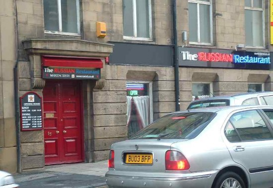

I admit the primary purpose of my blog isn't to commentate on the state of the food industry in the UK however every now and then my exceptional dining experience forces my fingers to bash violently in either blissful joy or rampant disgust. Unfortunately this review is of the latter type.

In Bradford, choice is not limited but variety is and it was this that drove me to try the Russian Restaraunt. We arrived at about 7pm only to be told they couldn't take card. For some reason I had a moment of English etiquette and decided that it would be a good idea to go to a cash point and then back. Big mistake, I should have just gone elsewhere.

Returning, cash wielded, we arrived back at the restaurant hoping for a truly cultural experience. Maybe that is what we got. It began with us ordering drinks, the simplest thing for any restaurant to accomplish without failure, surely? Not at the Russian Restaraunt. I ordered a £3 pint of natural orange juice. For that type of money I expected Katie Perry to come use any part of her body I wanted to squash the oranges whilst covering any song of my choice. I asked "Is it proper fruit juice" to which the restaurant owner replied. I'm not sure. I went for it anyway, mistake #2.

We decided on starters and mains and placed our order, this was an arduous task as both the restaurant owner and waitress (who couldn’t speak English) wanted to have a conversation with us trying to sell us a number of side dishes. Pretty annoying to say the least...

The starter came and we were further disappointed as the chicken pancake had transformed into a mushroom pancake. School boy error... At this point you are probably thinking, "Why aren't you walking out?” Well that's because I'm used to poor service in restaurants, this isn't my first review and I feel it's important to share good and bad experiences with others via the power of internets.

During the main course all of the earlier fails made quite a lot of sense and were somewhat forgotten as both of the dishes were great. Plentiful, full of flavour and good hearty food.

After we were done eating we waited 20 minutes or so for the waitress to come and collect the dishes and bring us a bill. This didn't happen so I went up to the cash desk and waited for the restaurant owner to finish his pointless conversation that other guests were cringing through.

Instantly the owner began an Oscar winning builder impression, this was because he didn't have a bill or any record of what our table had consumed. He looked at me and said on average a table in my restaurant costs "£20-£25 per head", "What would you pay?". Again I came over all British and replied "That seems fair -- however"... I then asked him if he wanted me to tell him about the things I didn't find quite right... He approved so I did...

We agreed on £20 per head, and I handed him my hard earned cash. He then proceeded to ask me if I wanted to join his mailing list, being a tech guy and getting thousands of emails every day the last thing I want is marketing spam from a restaurant I didn't enjoy. It was a stupid question and my answer was an obvious No... As he proceeded to try to sell me "Why I should be on his mailing list" I began to get a bit annoyed. I kept saying no and he didn't get it. I asked for a receipt. He couldn't give me one. If I was a tax inspector I would be suspect about this place for sure...

All of the above seems bad enough right? Possibly the only way he could go any lower was to go racist. As a lifelong Bradfordian I know that racism isn't just pointless, stupid and placeless. I don't expect it in Bradford, as a city we grew out of it and we hope that we can start reaping the benefits of being a truly multicultural city. When I said No to him asking do I want to join his mailing list, he asked me why I not. I told him I like to try lots of restaurants. As he lowered his voice and leaned in towards me he attempted to discretely scowl "They are all Asian though so the food is not so good". I hate any type of discrediting based on race or ethnicity. Simply put this is racist and the guy should seriously reconsider the location of his business.

The restaurant is only 10 minute walk from what is probably the best curry house in Bradford. The sweet centre.
