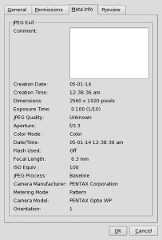

Did you know when you take a picture on your mobile phone it may add **your current location** to the [Exif data](http://en.wikipedia.org/wiki/Exchangeable_image_file_format) of the image?

So if you are out on a school trip and have GPS or location enabled on your device then you upload an image to an e-portfolio or blog **anyone** will be able to see the latitude and longitude of **where you took the picture.**

I discovered this when working on Classdroid and Kudos to [Hak5](http://www.hak5.org/) for the [useful link](http://regex.info/exif.cgi?dummy=on&url=http://demopupil.primaryblogger.co.uk/files/2010/07/wpid-IMAG0203.jpg).  Safe to say all images uploaded from Classdroid will set the location as: "The moon".

This is especially a concern if you out doing school trips and updating your blog on the fly.

**How to turn off location tagging.** On Android, Click Settings then Locations then un-tick My Location.
