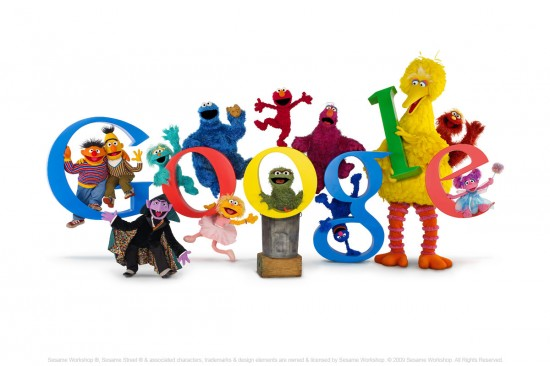

Sesame Streets Youtube channel and hundereds of [partners that aggregated videos from the Sesame street Youtube channel](http://primaryschool.tv "Primary School TV") today published indecent images and potentially extremely indecent video to children.

The pornographic videos uploaded by a hacker spread quickly around the internet, way too quick for Google who took 20 minutes to respond to the e-safety issue.

This is the first major instance where a major channel partner has been hacked and the target audience has been children. We can only assume that thousands of children have been affected.

It is not yet clear how the hacker managed to gain access to the Youtube channel that is currently suspended and not available.  Today's incident will lave Youtube and Google embarrassed especially after only 5 days ago Youtube released a "Youtube Channel for Teachers" and only a few months ago were promoting the sesame street brand on the Google Search home page.

Related articles

- [Sesame Street's YouTube Account Got Hacked with Porn Videos \[Hacking\]](http://gizmodo.com/5850322/sesame-streets-youtube-account-got-hacked-muppet-videos-replaced-with-porn) (gizmodo.com)
- [Sesame Street YouTube Channel Hacked with Porn (VIDEO)](http://www.blippitt.com/sesame-street-youtube-channel-hacked-with-porn-video/) (blippitt.com)
- [Top 10 Sesame Street Porn Titles](http://lunkiandsika.wordpress.com/2011/10/16/top-10-sesame-street-porn-titles/) (lunkiandsika.wordpress.com)
- [Porn hackers hit 'Sesame Street'](http://r.zemanta.com/?u=http%3A//www.cnn.com/2011/10/16/tech/sesame-street-hacking/index.html&a=58656618&rid=251b2f55-58c2-40e5-abed-cfa8ed4ad030&e=80071685b341fb316f372e7df24c910c) (cnn.com)

