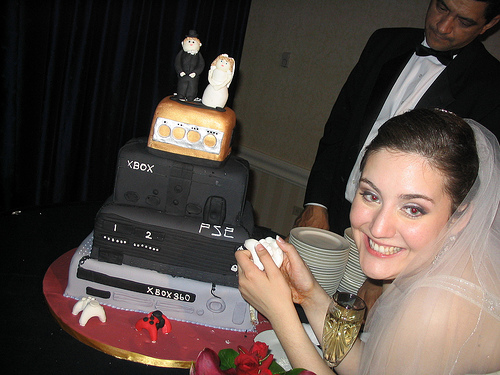

End of the 2009-2010 school/work year and it has been an immense year.  I'm signing off from work for a bit (2 weeks) to regain some sanity and reality but before I do here are the people I want to thank for this year.

**Ian Addison** (Great to chat with seems to understand both technical and teaching aspects of my work) **James Langley** (Great at everything to do with ICT and primary schools) **Chris Mayoh** (Fantastic feedback on our services) **Jo Dean** (Amazing understanding of making managed service contracts work) **John Sutton** (Fantastic understanding of encourage schools to adopt blogs) **Simon Finch** (second to none understanding of internet provision in schools) **Kumar** (Brilliant Android/Java developer) **Takeektas** (Amazing artist) **Redhog** (Breathtaking brilliant developer(this guy would blow your minds)) **Teeny Tiny** (Supportive, supportive, supportive.  Lucky to have known her so long) **Mark Chambers** (Every sentence is like a change factory) **Harshad Taylor** (Amazing sys admin with great network stability and flexibility and great personality) **Ramsbeb** (Great supported of modern technology) **Stefan Richter** (Genius behind scribblar very open to work with new services) **Joe Cornelli** (Great philosophical mind, I'm expecting great things) **Terry Freedman** (Always supported my articles, always been there for guidance) **Chris Ratcliffe** (I hate sales blokes but Chris breaks the mould..  Has been so keen to share and help, he puts edu first) **Tim Rylands** (Probably most inspiring man of year) **Deputy Mitchell** (I can only say thanks to this man, he works so hard, does so much, I think he has a doppel) **OmnomnomTom** (If code needs writing properly, this is the man I turn to) **Margaret Vass** (Great supporter of blogging, I truly hope glow supports her as well as we did) **Sharon Dominik** (the only person I always answer my phone to)

Everyone who works on an open source project.  Kudos, gg and ftw and obviously (this is delivered in person) those at Primary Technology who support and endure the challenges we all face on a daily basis.

And last but not least is my dad, who as you know is my alpha, beta and gamma.

Thanks so much for this year, everyone has made it special and I'm hoping 2010-2011 can provide some fruits for you to pick from!

Basic overview of my workload till next year up till April:  Launch new PST, Launch new SC (inc new standard), polish PGA, launch SIMS service, launch XPArena,
