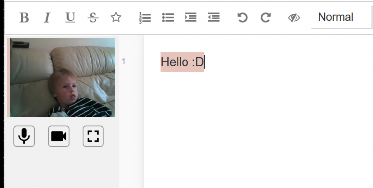

I contribute to a collaborative editor tool, Etherpad. It is excellent and really doesn't get enough love from educators Vs Google and Microsoft's offerings when I think it should.

Etherpad has [video conferencing visible in the document editor.](https://video.etherpad.com) 

Etherpad can be installed within 20 seconds.  No technical knowledge required.

Etherpad is a relatively long running project, in fact Google used our operational transform engine in Google Docs and Microsoft 'borrowed' heavily for 365.  Etherpad was the original web collaborative editor.

Etherpad is [open source](https://github.com/ether), built by a community, meaning we have complete transparency so if you get stuck or have an element you dislike, you can change it.

Etherpad is part of Software Freedom Conservancy which is a registered charity.

Etherpad wont change under you, Etherpad wont introduce a ribbon without the ability to disable it, Etherpad wont introduce a clippy without giving you a strong enough alcohol to banish it.

Etherpad can't go bankrupt if an economy tanks.

Etherpad has way more educational resources than Google Docs / Microsoft 365. Plugins such as MathJax, Text Statistics (grading of quality of writing), Accessibility such as text to speech and it's used by huge organizations (Wikimedia/UN) meaning Etherpad focuses heavily on localization and accessibility requirements such as Aria.

Etherpad's video and audio calls are not centralized, removing the main flaw currently constraining Google during these trying times. Also when you are back in a school environment if you do video calls between departments the video feed will stay inside your environment removing bandwidth requirements / costs.

Etherpad can be hosted within your organization, even at home.

Etherpad doesn't require any sign up, but various plugins exist if you want to have authentication to whatever mechanism you want and also for pad management. The world is your oyster.

Etherpad never loses document fidelity on export. Unlike Google docs and 365 when you take a document from Etherpad to another Etherpad instance no history of the document is lost. This means that any auditing for regulatory bodies is easy.

Phew, that's a lot of reasons to consider trying Etherpad :)

I salute Google and Microsoft and tools like Jitsi and other educational tools for everything they do for Education.  Etherpad is different from it's core and allows those more directly involved in Education to be empowered without a dependency on commercial software.

[Etherpad website for more information and to download Etherpad](http://Etherpad.org)

[Try Etherpad Video conferencing](https://video.etherpad.com)
