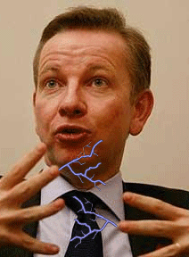

Why is a guy who wrote a book on "How the West's policy of appeasement has provoked yet more fundamentalist terror - and what has to be done now." [now the guy who wants to lead educational policy for the UK](http://www.michaelgove.com/)?  
  
Cameron claims the conservative party have a "strong team". In my opinion putting this guy in charge of Education is like putting Captain Jack Sparrow in charge of a new born baby.  No surprise then that the conservatives have [considered](http://www.educationinvestor.co.uk/ShowArticle.aspx?ID=1572&AspxAutoDetectCookieSupport=1) dropping the BSF scheme.  
  
I'm just saying the credentials don't add up.. Is he seriously the best the conservatives have for this very important job? If they want my vote they will need to do better..  
  
In case you were wondering about the [Lib dem's guy](http://www.libdems.org.uk/spokespeople_detail.aspx?name=David_Laws&pPK=b73d665c-8dcd-4c66-8ab2-4db5d2618630), he can be found here and it's the same sad song.  Same goes for Ed balls, only counter argument is that he was a teaching fellow and has had a few years in the post at current.  Gordon Brown also talks on this (if the sponsors price is right):  
  
  

Thanks to [Merlin John](http://www.agent4change.net/) for pointing this out

More videos like this can be found here  
  
So the question begs, when will a teacher or someone with actual teaching experience actually lead education in this country?
