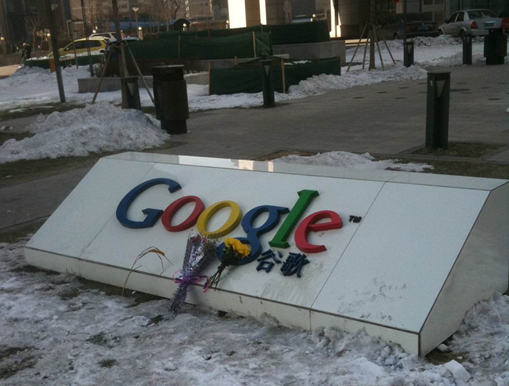

 I can't even give Google my money. I can't contact them. I can't report a bug. I can't use their services and/or pay them to improve their services.

Microsoft's alternative to Google's product is a joke, no surprise there...

So I give up... Web Search via an API. You are broken, you need help, someone call a doctor.  Google, you need a better way of communicating with your customers, take a lesson from Amazon, you are great at learning so learn, evolve or die.

_RIP Google - 15/12/2011_

If you depend on Google for a service I can only recommend that you have a "Get out plan".  Know about how to [liberate your data](http://www.readwriteweb.com/archives/how_to_liberate_your_data_from_google_and_why_it_m.php) and consider some alternative options.  Think about the important data you are going to lose when you liberate your data and how costly it will be to replace that data.  This is also a great opportunity for me to plug [open source software](http://opensourceschools.org.uk) and the freedoms that gives you.
