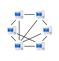

\[caption id="" align="alignright" width="249" caption="Image via CrunchBase"\]\[/caption\]

[Primary Technology](http://primaryt.co.uk "Primary Technology") required a business case for investing more money into our online backup solution.  That was the idea anyway but I actually came to the conclusion that online backup is not a good area to invest.  In this blog post I am going to try to justify my decision and hopefully give you an insight to why [online backup](http://schoolbackups.co.uk) is great for the consumers but costly for the provider.

## Scaling

Once you get to many terrabytes of data things become a bit more difficult to manage.  Elastic storage services do exist and if I'm honest storage isn't that much of a problem.  One thing that is a problem for smaller online backup providers is bandwidth bottlenecks.  If my software only has a single point of entry then I have a) a single point of failure and b) an awful bottleneck.  To overcome this problem can cost quite a bit of money, money that would need to be reflected onto schools so scaling costs money and the notion that it saves money over a distributed model is actually mathematically proven to be untrue (only in this instance with a schools data requirements).  So don't buy into the cloud just yet....

## Encrypted data

Encrypting your data is a great idea but it makes it a real nightmare for the offsite backup provider as you can't use a process called "de-duplication"..  De-duplication in it's simplest form is the process of being able to store one copy of "Michael Jackson - Thriller.mp3" instead of 10 copies.  A provider can look at the file you are trying to upload and say "Whoa I already have that file, no need to upload it".  This saves you bandwidth and the provider space..   As soon as you encrypt de-duplication is not possible as it's not possible for the provider to look at the file and make logic based decisions.

## Competitors and demand

I love the service dropbox/syncplicity etc. provider, they are clean, relatively low risk, fast and more importantly, FREE!  Great for teachers and students, terrible for IT admins looking to backup their databases.  The thing is when you think about data storage in general most of the data is being onto the internet and stored in web based applications such as PrimaryBlogger or PrimaryPad, so the value to a school of local storage is in decline.  [Here is a comparison of online backup software with an idea of cost](https://mclear.co.uk/2011/06/22/remote-off-site-backup-comparison/).  We considered writing our own but then we remembered that we create web based tools so we knew our own products in a way conflicted with this investment..  Another factor that is lowering demand for the service is the reduced risk of fires and burglaries.  I did a bunch of research into how these have changed, mostly using UK stats that are released by the Govt (and I'm greatful for this open data).

\[caption id="" align="alignright" width="119" caption="Image via Wikipedia"\]\[/caption\]

## The future

There's no doubt in my mind that a peer to peer method is by far the best method for schools to be backing up data.  I can't release the stats that I gathered but if you are considering writing a remote backup application you will want to use this method.  It has the obvious pitfalls and you will still need a single point of reference for this like emails to be distributed from but it is the lowest overall cost solution for the problem of online backup.  The basic log of peer to peer is that as hard disks prices drop and inter-school data links improve the real term cost of storing data between organizations falls through the floor.  Because it's now so cheep to store data you can store your data in 5 other schools.  Obviously this data will need to be encrypted but that's not a problem because we can afford the disk space.  

## Want to know more about my research?

This post is just a brief overview of my research that I put into online backups, I have a way more verbose article that is owned by Primary Technology.  I may be able to come in and talk to you about my findings if you want to know more!

**If you are still using tapes inside of your school then you need to really have a long sit down** think about what happens if those tapes are forgotten on site or lost/stolen with the data or don't actually work(as is nearly always the case).  [We(PrimaryT) do offer an online backup service that costs ~£200 per server per year, often a great saving if something goes wrong..](http://schoolbackups.co.uk)

