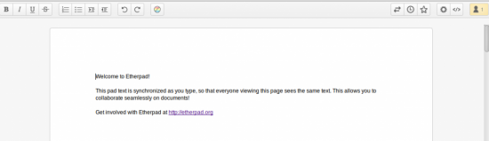
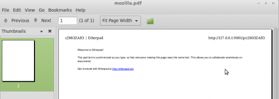
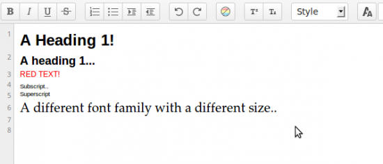
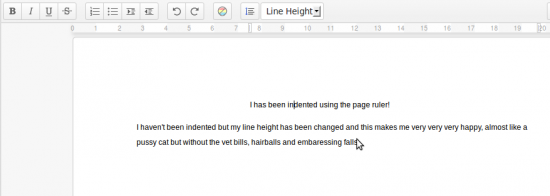
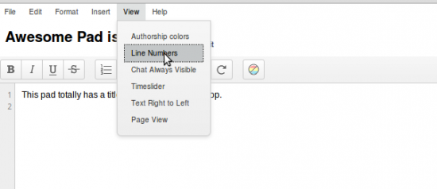
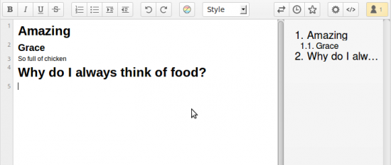

Etherpad changed a lot in 2013, the new functionality funded by various companies has mostly been released open source and this has meant a lots of new jobs and work availability for plugin developers. Firstly let's congratulate Etherpad on an amazing 2013, we're really proud of everyones achievements so far and let's hope 2014 can be yet another fantastic year.

### Etherpad can do that?!?!?

## 1\. Page View

 Page View brings in Document / Page Setup style editing to Etherpad. **Top tip: You can insert page breaks using Control Enter.** To get Page View install ep\_page\_view and either enable by default by editing settings.json or enable on a per pad basis by clicking the Settings button then clicking Page View. `npm install ep_page_view`

## 2\. Print a pad

 Printing a pad before used to leave the toolbar and chat icon on, with this plugin all other editor contents is removed leaving just the pad contents so you can get a lovely printable representation of your pad. Printing also supports page breaks so if you have the Page View plugin installed get breaking those pages up and printing them out. **Top tip: Printing is bad, don't do it unless you really need to, it is 2014 after all!** `npm install ep_print`

## 3\. Rich Text Editing

 By using the Headings, Font Family, Font Color and Font Size, SuperScript and Subscript plugins you can add rich text editing to your pads. Spot the obvious mistake in the image.. `npm install ep_headings2 ep_font_color ep_font_family ep_font_size ep_superscript ep_subscript`

## 4\. Page Ruler, Line Height

 Add a page ruler so you can use a ruler type thing to indent lines of text from the left/right. Line Height functionality means you can change the height of um, a line.. **Top tip: The page ruler plugin can be used with ep\_image\_preview or the image branch of Etherpad to resize images** `npm install ep_page_ruler ep_line_height`

## 5\. File Menu Toolbar and Pad Title

 Get a File Menu style edit bar that includes buttons to do stuff like File > New, Save etc.. **Top tip: Are you a plugin developer? File Menu toolbar exposes an EEJS Block that you can write to.** `npm install ep_aa_file_menu_toolbar ep_set_title_on_pad`

## 6\. Admin Pads

A way to admin and manage pads using Etherpad. `npm install ep_admin_pads`

## 7\. Markdown

[Use Markup/Markdown stylee editing in Etherpad](http://blog.etherpad.org/2013/04/14/5-new-awesome-plugins/) `npm install ep_markdown`

## 8\. Real Time Chat

Get real time chat updates. `npm install ep_real_time_chat`

## 9\. Table of Contents

 Get a visible Table of contents of the contents of your pad. **Top Tip: Use headings to automatically create a table of contents** `npm install ep_table_of_contents ep_headings2`

## 10\. Lots more..

I ran out of space but here are some more awesome plugins you should check out.. ep\_clear\_formatting - Clear the formatting/attributes on a selection ep\_sticky\_attributes - See what attributes are applied to a selection ep\_copy\_paste\_select\_all - Put a copy / paste / select all item in the file menu (requires file menu) ep\_special\_characters - Insert Special characters into a pad ep\_define - Define and Research a selected word (requires file menu) ep\_text\_to\_speech - Speak a selection from a pad (requires file menu) ep\_comments - Apply comments to a pad
