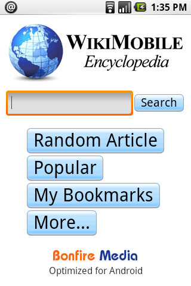

To use an Android phone in your classroom you will find a great deal already available to you on the device however you will probably want to get some applications from the market...

To get an application simply goto your home page on the device, Click Android Market, search for one of the below apps:

**FEATURED** - Classdroid is an app I work on.  It is open source and free.  It is used as a simple assessment app where a teacher takes a picture of a pupils piece of work, grades it and assigns it to a pupil.  The work is then uploaded to the pupils learning portfolio.  [Visit here to find out more about Classdroid](https://mclear.co.uk/sites/classdroid)

1\. Zebra Paint - Paint with your fingers! Pick your favorite color and paint the image. Use the menu button to pick one of the dozen built-in templates. When ready, save your images and share with the world! Tested with 4 to 5 year old kids. Requires a touch screen.

2\. Maths Workout - Test your mental maths and exercise your brain once a day. Maths Workout is a daily routine for thousands of players worldwide – both young and old. Get competitive! Play the World Challenge and submit your score for ranking with other players around the world.

3\. Brain Genius Deluxe - Get a head start to getting smart by playing through a daily dose of teasing and original brain exercises. Brain Genius Deluxe is the Android game to train your brain, with 24 touch and motion-controlled games as well as bonus puzzles including Sudoku! It’s pure Genius!

4\. WordPlayer Art of War - WordPlayer is a book reader that allows you to add to your library from amongst thousands of instantly downloadable books or load epub books. WordPlayer's page navigation, highlighting, bookmarking, and customizable settings make reading a breeze. Comes with Sun Tzu's classic book of strategy, Art of War, already installed.

5\. My Maps Editor by Google - Create, edit, share, and view personalized maps on your phone synchronized with the My Maps tab on Google Maps. We provide full editing functionality for markers, lines, and shapes, plus you can mark your location using GPS or attach a photo directly from your phone.

6. WikiMobile Encyclopedia - Being a walking encyclopedia is now at your fingertips. With WikiMobile, you carry 2+ million Wikipedia articles with you, including pictures. Faster and uses just a fraction of the network data vs. the Android browser. Download free for a limited time!

****7\. Google Sky Map**** \- Google Sky Map: A star map for Android. Google Sky Map turns your Android-powered mobile phone into a dynamic window on the night sky. When you point your phone up you will see a map of the brightest stars, constellations, and planets in that part of the sky.

8\. Pintail (not educational but useful) - Lost your pho

ne? Find it with an SMS: Pintail replies automatically with your phone's location to a PIN protected message. Let friends and family ea

sily find out where you are by sharing your PIN number with them: They send an SMS, Pintail replies with your location.

****9\. School Email**** (UK only as of yet) - You don't need to download this! School Email is the easiest and safest service for emailing between pupils and teachers. Pupils emails are checked for sexual predators and bullying. The service runs over Activsync which means pupils are always "up to date".

****10\.**** ****Keepy Uppy**** - If you are struggling getting young boys who enjoy football(soccer) to use their device you may want to think about using an app such as Keepy Uppy as a reward for good work.
