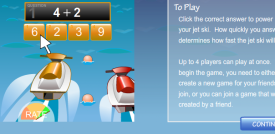
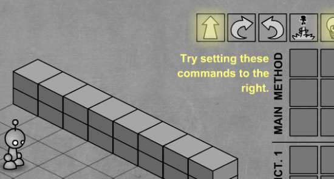

A good educational game isn't a linear process, a good game engages children to a point where the game itself becomes a consumable and desirable entity away from the influence of teachers & educators.  A lot of game creators miss this point, pupils therefore learn to do and not to think.  This is detrimental to learning in my opinion and it only encourages assessment models that don't truly reflect a pupils ability to be a good citizen.   We should never forget that no matter how we dress it up, **Multiple choice tests are not fun and single choice is the opposite of fun.**

In 2010 due to an influx of game creation tools educators began thinking about how they could create games and this is great but it increased the amount of hot air single choice, linear games to a new all time high.   5 games this year really set themselves apart from the hot air that was released, here they are:

## [Admongo](http://primarygamesarena.com/redirect.php?id=10216)

Admongo is a side scroller designed to teach kids to be aware of marketing and advertisements. Consumerism is a huge driving force in today's conflicts and I believe we need to be mindful of why we consume certain things.

* * *

## [Jet Ski Addition](http://primarygamesarena.com/redirect.php?id=383)

This game is great because it encourages competitive learning.

* * *

## [Mystery Island](http://primarygamesarena.com/redirect.php?id=2965)

Mystery Island gives pupils the ability to find their own way through a world and encourages adventuring whilst solving micro problems by delivering packages.  This is probably my personal least favourite yet it is one the most popular games with kids so I thought I'd throw it in!

* * *

## [Geosense](http://primarygamesarena.com/redirect.php?id=2015)

I'm not gonna lie, this game sucks you in, prepare to waste a good 15 minutes increasing your knowledge of locations on the Earth.

* * *

## [Light Bot](http://primarygamesarena.com/redirect.php?id=2639)

Pick your way to solve the control problem. This game teaches the logic behind control and movement. It is actually quite linear but it requires strategic thinking and planning. Light Bot is way more fun than multiple choice and that's why I like it :)
