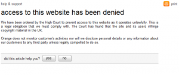

Sky, Everything Everywhere, TalkTalk, O2, Virgin Media and Orange are now blocking The Pirate Bay.  You should consider switching your ISP to one that doesn't block The Pirate Bay.  Please leave comments to let me know if your ISP is blocking websites or not.

Kids.  The decision to block any website is an example of bad governance.
