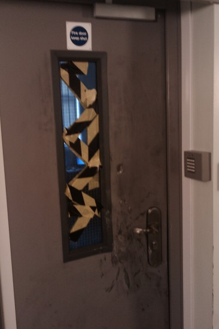

Yet another burglary last night in a Bradford Primary School. Yet again the thiefs target is the technology. [PrimaryT](http://primaryt.co.uk "Primary school ICT services") is the maintainer and provider of this technology so it is somewhat concerning that the schools ICT budget will be spending more of their budget on insurance premiums next year instead of new kid for the kids to use.. But wait.. Not at this school because a recently installed security door thwarted the thieves..

In my opinion **you can't get much lower than stealing from resources primary school kids use to learn with**.   I realize that anyone reading this is  already in that school of thought.  I guess I'm completely biased though and blind to the other social subtleties at play in the surrounding area.

The school is going to need to replace some parts of that door though if not the whole thing.. It's not all bad news at least as the kids can still continue to learn with technology :)
