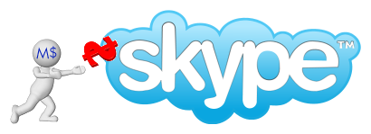

Microsoft's $8.5bn purchase of Skype has raised a few eyebrows, but we don't care about most peoples, what we care about is how this purchase will **affect Primary Schools**.  In this post I am going to try to summarize the real life impacts of such a purchase and how you should consider using Skype in the classroom.

Things we can expect:

- Skype will come bundled with Windows 8.
- Open source & tech folks will stop using Skype and begin looking at alternatives.
- Google will be panicking.
- Windows Mobile 8 will have a big emphasis on VOIP connectivity
- Microsoft will attempt to play a bigger part in mobile data connectivity
- Skype and the VOIP stuff used for Xbox Live will be integrated
- You will be able to Sign into Skype using your XBLA or Microsoft.com/Live.com account

Microsoft will use Skypes deep telco contracts to **leverage cheaper mobile communications**.  With all these new connections and contracts it is conceivable Microsoft will partner with a manufacturer to provide a data connected laptop/netbook using the Amazon Kindle model of data.  The kindle model of data is basically a pay once, use forever but it has recently been announced this is **likely to be subsidized by adverts appearing on your device**.   You should seriously think about [where you stand on Ads in the Primary School Classroom](https://mclear.co.uk/2011/03/09/should-we-be-showing-online-adverts-to-kids-in-primary-schools/).  I think the potential use of these "light internet use netbook devices" could be perfect but basic net browsing however they won't be suitable for 5+ pupils in the same classroom browsing "rich-content", whatever that is in 3-10 years time.

If you are interested in **e-Safety** then I would say that now is a great time to have a really good think about the e-safety risks that Skype poses, especially if it is going to be installed natively on Microsoft Windows devices.  Skype has the same e-safety challenges of Facebook, it just gets less attention because it currently isn't as widely adopted.

You may be wondering if you should sign up for the [Skype in the Classroom](http://education.skype.com/) and I would say go ahead, it's unlikely Microsoft will lose this battle in the same way they lost\[/committed suicide\] the MSN battle.  Skype was running at a loss and Microsoft has basically "bailed it out" and given it a long future.  At [Primary Technology](http://primaryt.co.uk) we use Skype as our main source of voice communication and we have no plan to leave it as it provides great value.  We will leave Skype is a good, open source source, distributed telco connected solution appears, I doubt that though.

So to summarize..  We are one step closer to getting 4G connected Windows devices, we have an elevated e-safety issue to address, Microsoft own yet another part of your life.
