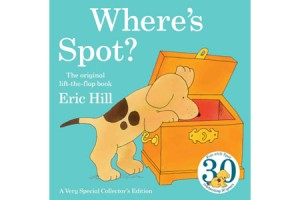
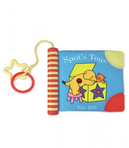

\[caption id="attachment\_2346" align="alignright" width="300" caption="Spot before"\]\[/caption\]

\[caption id="attachment\_2347" align="alignright" width="262" caption="Spot after"\]\[/caption\]

We all know what a children's illustration looks like right?  Sort of in-between Dr Seuss and the Gruffalo, maybe with a bit of Spot thrown in.  What I want to know is why in all of the test groups I have done over the last few weeks the most vector/cartoon style stuff is more popular with kids (both boys and girls) from the ages of 8 to the ages of 12?

## Explain yourself

Spot is a good example of an illustrator moving their illustrations towards what we have found is a "preferred style of art" amongst Primary School age children.

## What has changed?

The objects have become simplified and the "stroke" effect has been used with a greater thickness.

I can only assume that cartoon channels such as Nickelodeon & The Cartoon network have changed the style of art that the children I spoke to enjoyed.  I know this is all very speculative and I am making some big assumptions but the evidence I have found whilst trying to find the correct illustrator for [Safe Search](http://primaryschoolict.com) has shown me that kids prefer vector based art as opposed to hand drawn objects..

## How does this even matter?

Well it means that in the future we will try to keep our art more vector based, we will hire graphic designers/artists instead of illustrators.  There is a place for illustration and I'm sure if they are done right they can look great however I can be confident in saying that Primary Technology will be sticking to the style we have used in the past as it seems to be a winning formula(despite the fact I tried to break it).  Please don't take this post as factual, it is not scientific.   It is my opinion based on my experiences of a small(handful) of children in only a few schools.

###### Related articles

- [Hiring Illustrators](https://mclear.co.uk/2011/01/16/hiring-illustrators/) (mclear.co.uk)

