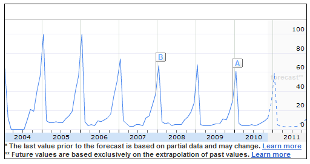

_Disclaimer:  Views in this post are my own and are intended to help Emap improve BETT.  I am not "knocking the institution", I am simply voicing my feelings & concerns._

**The technology in education market is still recovering from a huge E-Learning credit hangover, temporarily remedied by the "Harnessing Technology Grant" which acted as a sort of short term "fry up" solution.**

Thankfully we never became dependant on either pots of money but a lot of companies did and then extended their debts into BSF bids which could only be propped up by [Venture capitalist](http://en.wikipedia.org/wiki/Venture_capital "Venture capital") investment.

VC investment meant the stakes placed on ICT in Education were higher than ever and subsequently the marketing budgets available for the "top dogs" increased.  Naturally prices for BETT increased and we begin our tale called "The Hair of the BETT dog".

In this post I am going to be documenting why we aren't exhibiting at BETT 2011 in the hope to help Emap make future policy decisions that properly reflect exhibitors needs, especially the needs of small start ups with great new ideas.

## Less delegates are attending

\*Google Insight showing BETT Show search terms by frequency.  According to Google Searches BETT peaked in popularity in 2004 and has declined ever since.  Of course Emap will claim this isn't true, yet there are pictures from BETT 2010 showing periods of time where entire isles were soulless.  It would be interesting to see some sort of Average # of delegates per square meter over a 10 year period to see how that weighs up.

## Yet it's getting bigger

More and more companies were exhibiting during the "drinking period" so BETT grew it's floor space.  Over the last 4 years it feels that less companies are exhibiting and you see a lot of unused, open stands.  This shows a lack of demand and therefore the exhibitor price should reflect this.  So does it?  No.  BETT's price year on year has risen -- As a Yorkshire man I can safely ask "What the deuce?".

## Value for money

Take for instance [PrimaryPad](http://primarypad.com), to exhibit PrimaryPad we need 4+ Machines to demonstrate the power of its collaborative writing. Will our presence at BETT sway them to purchase PrimaryPad?  Possibly, but how many schools would need to purchase PrimaryPad just to cover the overheads of BETT?  400, unless we put our prices up (which we had to do with School Email when that went through this same process)..

Sponsoring events such as Teachmeet allow us to engage with educators in a much more intimate environment for a fraction of the cost of exhibiting at BETT.  BETT is often a small business' largest annual single purchase.

## Real life is slow

The internet is much faster, we used to attend BETT to find out the latest things companies are doing but now companies have blogs, newsletters, email mailing lists, radio stations & tv channels constantly keeping us up to date..

BETT isn't e3, no one saves their hype for BETT.  No big major announcements are made at BETT.

I struggle most years to do a top 10 BETT new technology that is truly reflective of a classrooms needs mostly because I have already either a) reviewed the item/service before or b)  it was a great idea but hidden away in a tiny stand upstairs that no one can get to.

## Green issues

Technology is never green, but consider how insane it is to travel to see a demonstration of a web based piece of technology?  Getting my head around that is an issue, so many great tools exist for demonstrating your products over the internet that the notion of travelling at all to see new technology is just a bit well, erm, old fashioned.

## Appearance

We want to be seen as a modern, forward thinking company.  BETT should reflect our needs by offering us more cost effective ways of engaging our customers.

## The BETT Award

The award is one of my bug bears about BETT.  A lot of emphasis is placed around the award yet it is hard to meet people who work in the industry that don't think the agreement for who will win the award is done in a dark, smokey room, somewhere in westminster and goes to the highest biggest candidate.  However some great companies/services/products have won the awards so it's far from all doom and gloom :)

## Summary

I think BETT is a fantastic national treasure but it's time for a new angle, something value reflective for both small and large exhibitors.  All of the staff at Emap did a great job last year and all in all BETT is a fantastic CPD tool for teachers.   Drinking time will start again soon but until that time let's consider a way of nurturing small, creative business instead of scaring them off with huge overheads.

To any company/marketing execs reading this then you should know that if your company isn't being interesting all year round and communicating well with teachers then you will still not be interesting at BETT.  Your marketing will fail if you focus on a once a year push.

Animated Images courtesy of "[If we don't, Remember me](http://iwdrm.tumblr.com)"..

## The response this post got from the event organizers

Joe Wilcox from EMAP (the company that handles the BETT event) responded to this blog post:

There is a good chance that readers of this blog for whom the annual BETT show is very well-known are not familiar with me or my role at the organising company, Emap Connect. I joined the company in July last year as the Content Director responsible for any current and planned events or media properties bearing the BETT name. Thus far, I’ve had the pleasure of working to keep the BETT seminar programme populated with insightful speakers, a task made more challenging by the demise of Becta, via which a significant percentage of seminar leaders were confirmed in previous years. I have also really enjoyed creating from scratch two new leadership conferences being hosted alongside BETT for the first time next week. These are designed to ensure that school leaders and representatives of national, regional and local government from the UK and from the wider world continue to attend the show in good numbers, i.e. by adding a compelling new reason to attend. Another enjoyable activity was travelling around the Middle East forming alliances with the ministries and school operators with whose valuable support we successfully delivered - back in November in Abu Dhabi - the inaugural BETT-branded event specifically created to connect the educators of that region with technologies designed to improve their systems and learning outcomes. Going forward, I will be expected to have some input into the strategic direction of BETT here in the UK and around the world.

When I saw John’s article explaining why his company has chosen not to exhibit at next week’s BETT show, I accepted that the piece was written in the spirit of offering my colleagues and I some advice on how best to keep the event relevant, well-attended and genuinely useful. We accept fair comment and don’t want to get into arguments with anyone who wishes to articulate an opinion about the value of BETT.

I do, however, wish to point out that the article contains a significant factual inaccuracy which readers should keep in mind when considering the views that John has expressed.

John alleges that BETT attendance has fallen over the period 2004-2010. The evidence that John offers is that “according to Google Searches BETT peaked in popularity in 2004 and has declined ever since.” He remarks that “of course Emap will claim this isn’t true”. Indeed, not least because BETT attendance figures are audited by ABC ([www.abc.org.uk](http://www.abc.org.uk)), whose role is the i_ndependent verification of media performance, thereby providing a major trading currency for media buyers and owners across print, events, digital and evolving platforms._

_Here are the numbers:_

|  | **BETT 2010** | **BETT 2009** | **BETT 2008** | **BETT 2007** | **BETT 2006** | **BETT 2005** | **BETT 2004** |
| --- | --- | --- | --- | --- | --- | --- | --- |
| **Total** | 36955 | 38359 | 35881 | 29343 | 28315 | 27015 | 24508 |
| **Visitors** | 29262 | 29496 | 28438 | 29343 | 28315 | 27015 | 24508 |
| **Exhibitors** | 7693 | 8863 | 7443 | NA | NA | NA | NA |

Yes, the 2010 event was a little less well-attended than the previous year’s show, but following a nice jump in visitor numbers from 2004 to 2005, I would say that the size of the crowd with whom exhibitors have the chance to engage has remained fairly steady over the period that John examines in his article. John has taken a decline in the frequency of Google search terms as evidence of BETT shrinking, but there must be some other explanation for why fewer people are now Googling the name ‘BETT’ than back in 2004. Answers on a postcard, please!

John doesn’t currently find that an investment in BETT makes sense for his particular company and of course it’s entirely in his gift to arrive at the conclusion. It was gratifying, though, to read that he continues to praise the show’s benefits for visitors. I also take very seriously John’s suggestion that BETT might offer more value to larger organisations than he feels it does for companies of the scale of his own. I feel we’ve gone some way towards addressing that with the creation of an expanded ‘Innovation Avenue’ zone at this year’s show. This offers space at a reduced rate to companies in start-up mode. This is a step in a positive direction, I feel, and we are looking at ways of going further along that route within the practical constraints of using the Olympia site. I am certainly open to suggestions about this question and about every other aspect of what BETT does, who it serves and how they are might be served better. Keeping this open-mindedness at the heart of what we do is part of my brief here. With this in mind, I shall be assembling a BETT Advisory Board as shortly after next week’s show as I practically can. This will be composed of a rich mix of BETT stakeholders – visitors and exhibitors; large exhibitors and small; BETT loyalists and BETT critics. I have extended an invitation to John to be a part of this and I look forward to his contributions to the discussions.

To everyone who will be joining us at Olympia next week, I offer my thanks for your continued support and hope you find the trip enjoyable as well as productive. If you won’t be joining us this time, I’ll see what we can do to tempt you into West London in 2012.

Joe Willcox, Content Director, Emap Connect
