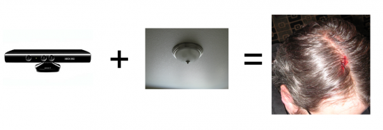

 Unless you have been living in a dark shell for the last 6 months you will know about Microsoft kinect. In my opinion the advertising for kinect doesn't show the actual potential of the kinect technology. I think the most promising aspect of Kinect is the Speech recognition and it looks like Microsoft may of actually got this right..

Each bing = good.

So it appears to work, and if we can just say, y'know. Collect 3 stars there is no need for incidents like this:

This video shows the potential of using Kinect's depth perception to control a user interface with multitouch.

Finally, The facial recognition is supposed to really good. Sounds like the Kinect hardware is going to be a winner. I don't know what % of users will end up owning a 360 so my recommendation to you is to treat the Kinect as a separate platform.

If you are a developer I would consider focusing on preparing your offline and online material for "Kinect aware" devices. If Kinect aware adobe flash content begins popping up it could create a whole new market place and genre of game.

This video shows how the Kinect can replace a conventional smart board: 

This video shows it's potential use to control puppets!! Awesome!

Here is a video that demonstrates how game creators are compensating poor control quality by adding auto steering to make the gaming experience feel less detached..

This is nice, it shows using multiple Kinects to map a physical space to a 3d model.

Remind anyone of the [Eyes to the front](mclear.co.uk/sites/eyes-to-the-front-classroom-software-concept/) proposal I did?

[Kinect gesture recognition controlling web browser(chrome)](http://www.readwriteweb.com/archives/kinect_browser_navigation.php?utm_source=feedburner&utm_medium=feed&utm_campaign=Feed:+readwriteweb+\(ReadWriteWeb\)&utm_content=Google+Reader)

Some guy in Essex has written a driver for controlling Windows 7 (sort of like a touch screen)

If MS release face detection as part of an API then a simple facial detection system for class registration.

Kinect could also be used as a tool for assigning IWB control to pupils.

I think we should look past the obvious of just UI control in a touchscreen format, we must remember the potential for depth.

Here we can see a kinect being used to pass control from one user to another..

<iframe title="YouTube video player" width="600" height="350" src="http://www.youtube.com/embed/2MX1RinEXUM" frameborder="0" allowfullscreen></iframe>
