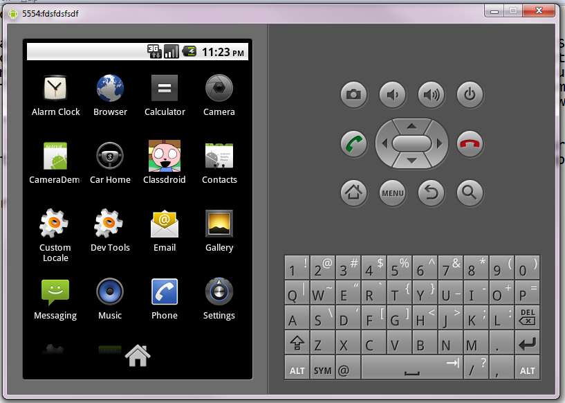
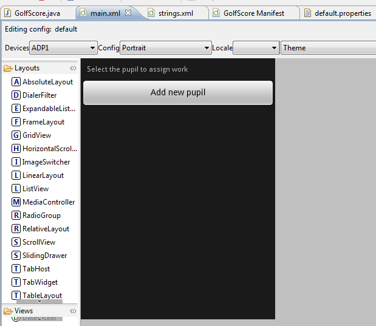

Today I started on my journey towards Droidville, past the gargoyles of SDKs and into the realm of eclipse. I began my journey equiping myself with the finest weapons possible in the form of eclipse and android sdk including all the power ups and runes. I stopped for lunch at bar youtube where I indulged in an excellent [documentary](http://www.youtube.com/watch?v=rm-hNlTD1H0&hd=1) and began my developing whilst following the gentle, slightly distant voice of the presenter. "Whisper **control shift oh!** to the sage and ye be blessed with organized imports" I heard him mutter under his breath..

Hours went by and the youtube video was stopped, rewound and replayed various times, as the sun set I had my Hello world working and some UIs designed, unfortunatly my Hello World app is called com.golf.. The icon is set. If this is groundhog day let it end...

Flute playing and shots of rolling hills come into screen..

Will tomorrow bring safer travels for our hero?

